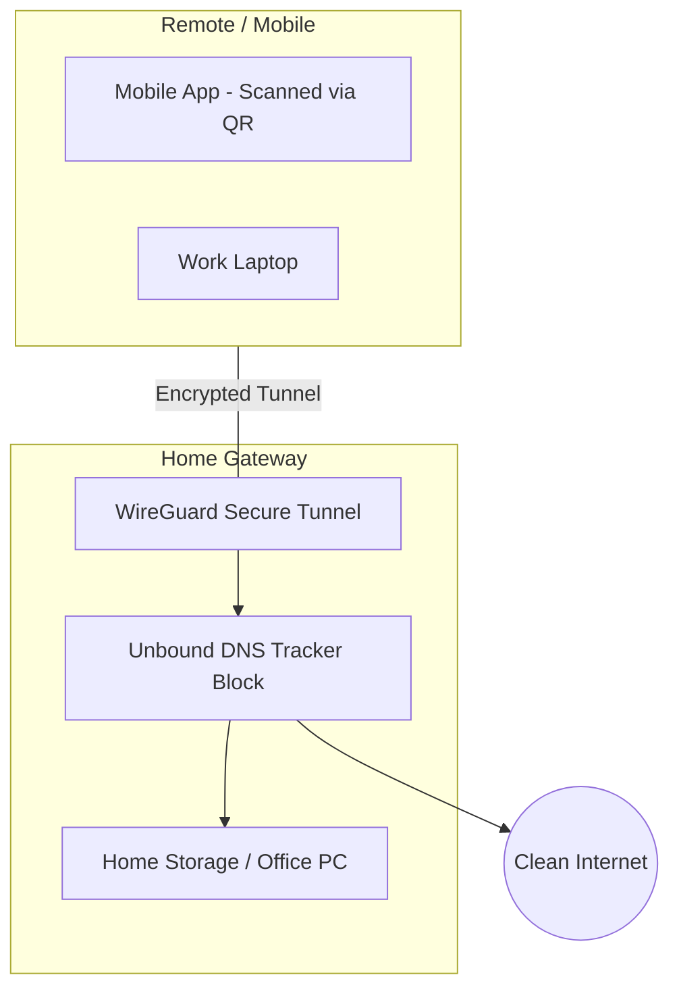

# Overview
Stop paying for monthly VPN services that throttle your speed and log your data. LynxEdge turns your high-speed home internet into a private, encrypted tunnel. Secure your mobile devices, access your home office, and block invisible trackers—all through a gateway you own and control.

# The Modern Edge: Why LynxEdge?

## 1. Leverage Your Own High-Speed Internet
Don't settle for the congested servers of "Big VPN" providers.
* **Direct Performance**: Route your traffic through your home's fiber or high-speed cable connection.
* **No Monthly Fees**: Eliminate recurring $10–$15/month costs of commercial VPN services.
* **Full Speed Encryption**: WireGuard integration provides the highest throughput available in modern networking.

## 2. Zero-Touch Setup: Instant QR Provisioning
Connecting your mobile devices has never been easier. 
* **Scan & Connect**: Generate a secure QR code via `lynxctl` and scan it with your phone to instantly import your profile.
* **No Manual Keys**: Forget typing long cryptographic strings; the gateway handles the handshake generation for you.
* **Mobile Ready**: Optimized for iOS and Android WireGuard clients for a "set it and forget it" experience.

## 3. Secure Access to Your Home Office & Storage
Your files and office desktop stay behind your firewall, but remain at your fingertips.
* **Private Cloud**: Access your home storage (NAS) as if you were sitting in your living room.
* **Home Office Bridge**: Remote into your work PC or internal office resources with enterprise-grade security.
* **Encrypted "Café" Tunneling**: When you connect to public Wi-Fi, LynxEdge instantly wraps your traffic in a secure tunnel back to your home.

## 4. Total Privacy: Block Trackers You Can't Control
Apps on your phone constantly leak your habits. LynxEdge stops them at the network level.
* **Unbound DNS Filtering**: Malicious domains and trackers are blocked before they even load on your device.
* **App Telemetry Suppression**: Silence "phone home" trackers from apps that you don't control.
* **DNSSEC Validation**: Ensure every site you visit is the real one, protecting you from spoofing attacks.

# Secure Connection Architecture

# Summary of Savings & Security

| Feature | Commercial VPN | LynxEdge Gateway |
| --- | --- | --- |
| **Monthly Cost** | $12.99/mo (Average) | **$0.00** |
| **Setup** | Manual Login/Pass | **Secure QR Scan** |
| **Data Privacy** | Provider sees your traffic | **You are the provider** |
| **App Trackers** | Often ignored | **Active Blocking** |

---